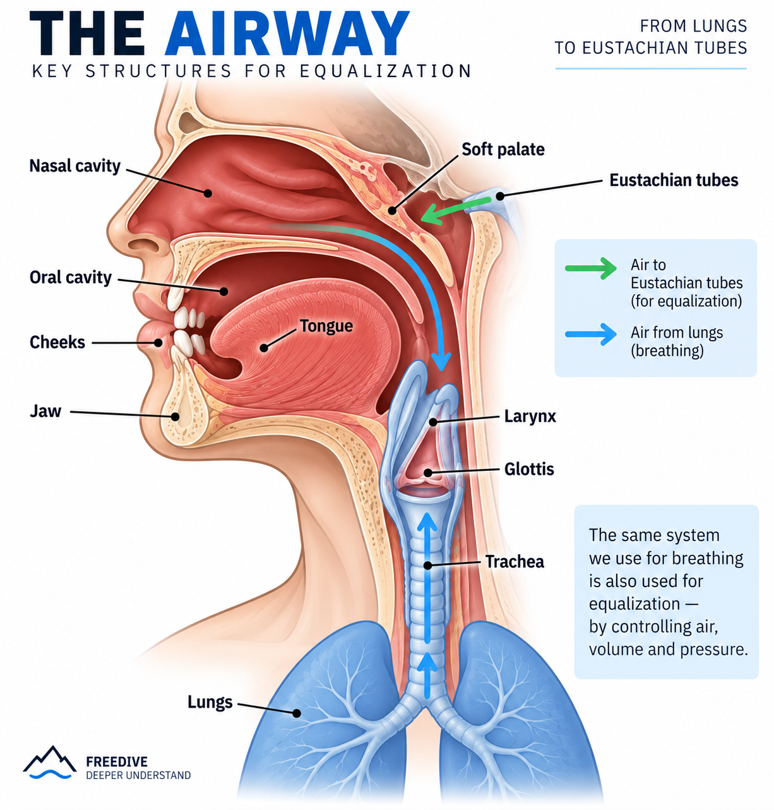
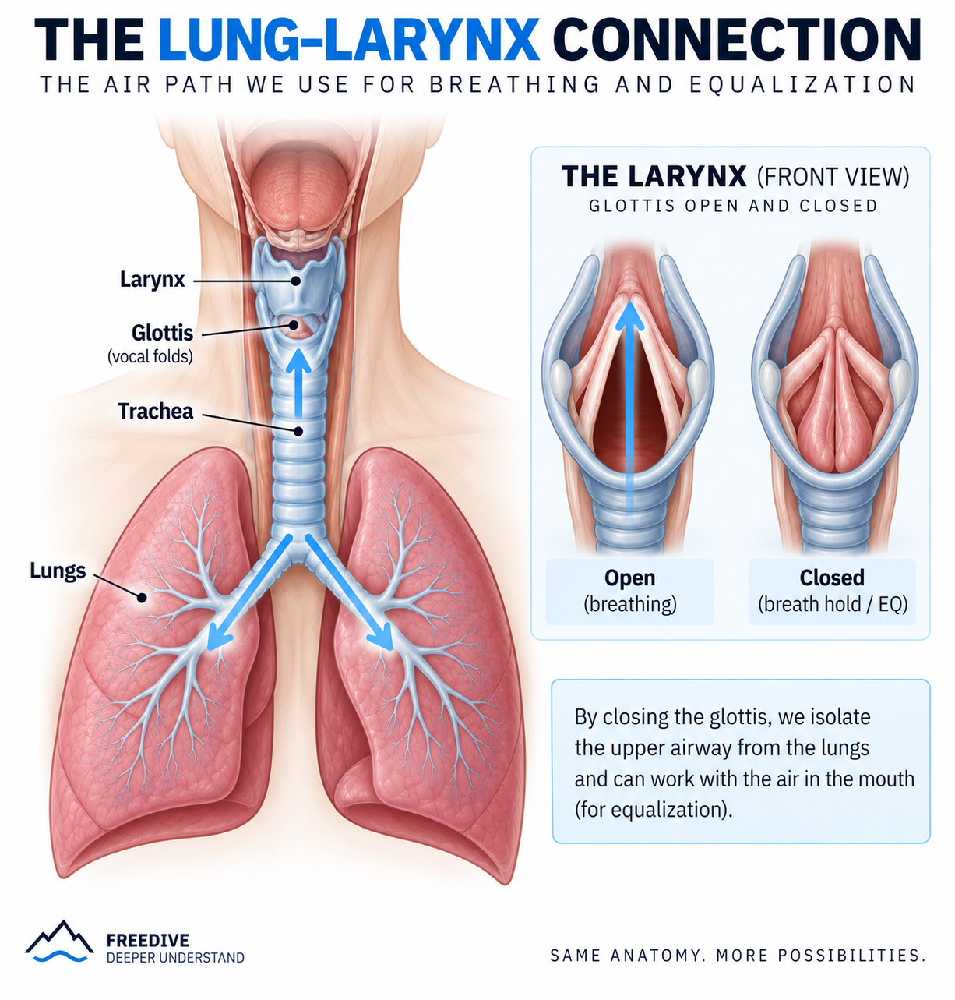

# PART 1 — THE AIR & THE EQ SYSTEM

**Duration:** ~45–50 min

## Methodology

Throughout Part 1, every exercise is performed and compared in **two body positions**:

- **NORMAL** — seated, upright position
- **INVERTED** — head down in an aerial yoga hammock

The objective is not to assume that inversion changes the result, but to **observe and compare what actually changes** in sensation, air movement and pressure.

**EXPLAIN → FEEL → SEE → MEASURE → INVERT → REPEAT → COMPARE**

- **Explain** — what the structure does
- **Feel** — perform the movement and identify the sensation
- **OtoVent** — observe physical / tactile feedback
- **UBA EQ Tool** — observe the pressure response
- **Invert** — repeat the same exercise head-down in the hammock
- **Repeat** — perform the same movement and protocol
- **Compare** — identify differences in sensation, air movement and pressure response

---

## 1. EQ IS NOT FORCE

**Duration:** 3 min

### Key concept

> Equalization is not about pushing harder.  
> It is about managing air, changing volume and creating pressure.

### Basic model

**AIR → VOLUME ↓ → PRESSURE ↑ → EUSTACHIAN TUBE → EQ**

### The main players

|  |  |
|-|-|

- **Lungs** — air reservoir
- **Larynx** — volume / pressure control
- **Glottis** — gate
- **Tongue** — seal / lock
- **Jaw + cheeks** — volume and air management
- **Soft palate** — pathway / direction

### OtoVent

Perform 1–2 simple attempts with minimal effort.

**Goal:**

> Do not look for maximum pressure.

### UBA EQ Tool

Perform 1–2 normal attempts.

Observe:

- pressure curve
- speed of pressure increase
- repeatability

**Do not use maximum pressure as the performance goal.**

---

# 2. WHERE IS THE AIR?

**Duration:** 4 min

### Air pathway

**LUNGS → LARYNX → ORAL CAVITY → NASAL CAVITY → EUSTACHIAN TUBES**

Introduce two different reservoirs:

### Lung reservoir

A large source of air.

### Oral reservoir

A smaller volume of air that can be stored and manipulated in the mouth and cheeks.

### OtoVent

Experiment:

**lungs → mouth → OtoVent**

Then close the glottis and work only with the air already in the oral cavity.

### Goal

Feel the difference between:

- working with a large lung reservoir
- working with a limited oral reservoir

### UBA EQ Tool

Compare:

**large air movement**

vs.

**small isolated air movement**

---

# 3. LARYNX — THE VOLUME CONTROLLER

**Duration:** 6 min

## Concept

### Larynx ≠ glottis

- **Larynx** = anatomical structure
- **Glottis** = opening / gate within the larynx

The movement of the larynx can change the configuration and volume of the air space.

### Exercise 1 — Larynx awareness

Practice:

- swallow and feel the larynx move
- imitate a swallow / "gulp"
- slowly move the larynx up and down
- hold different positions

### Exercise 2 — Larynx + closed airway

Hold the breath.

Practice controlled laryngeal movement without releasing air.

### Goal

Feel:

**movement → volume change → pressure response**

The goal is **not** to perform an equalization.

The goal is to learn:

> I can change an internal air volume without simply releasing the air.

### OtoVent

Perform the same controlled movements while observing the OtoVent response.

### UBA EQ Tool

Repeat the exercise and observe:

**laryngeal movement → pressure response**

---

# 4. GLOTTIS — THE GATE

**Duration:** 4 min

## Concept

The glottis controls the connection between the lungs and the upper airway.

### Basic states

**OPEN**

→ air can move

**CLOSED**

→ air is isolated

### Everyday examples

- breathing → open
- swallowing → closes
- coughing → forceful closure
- breath hold → closed

### Exercise

Practice:

**Breathe → Hold → Cough → Hold**

Focus on feeling the difference between:

- laryngeal movement
- glottis opening / closing

### OtoVent

Create a small amount of pressure.

Experiment with the airway open vs. closed.

### UBA EQ Tool

Compare:

**open airway**

vs.

**closed airway**

### Key takeaway

For techniques where we need to work with a limited air volume:

> **The glottis must isolate the upper airway from the lungs.**

---

# 5. JAW — CHANGE THE VOLUME

**Duration:** 4 min

## Concept

The jaw changes the available space inside the oral cavity.

**Jaw ↓ → volume ↑**

**Jaw ↑ → volume ↓**

### Exercise

Slowly perform:

**OPEN → CLOSE → OPEN → CLOSE**

Then imitate a relaxed yawn.

### OtoVent

With air in the mouth:

**jaw open → jaw close**

Observe the feedback.

### UBA EQ Tool

Repeat:

**open → close → open → close**

Observe whether the volume change produces a pressure response.

### Key takeaway

> Pressure can be created without performing a Frenzel.

---

# 6. CHEEKS — RESERVOIR + COMPRESSION

**Duration:** 4 min

## Concept

The cheeks can:

1. store air
2. move air
3. reduce the volume of the air space

### OtoVent exercises

1. Inflate both cheeks.
2. Hold the air.
3. Isolate one cheek.
4. Move air:
   - left → right
   - right → left
5. Slowly compress the cheeks.

### UBA EQ Tool

Practice:

**LOAD → HOLD → COMPRESS**

Observe the pressure curve.

### Key takeaway

> The cheeks can act both as an air reservoir and as a mechanism for reducing air volume.

This will become particularly important when introducing **Mouthfill**.

---

# 7. TONGUE — SEAL

**Duration:** 6 min

## Concept

Do **not** start by defining the tongue simply as "the piston."

First introduce its ability to create a **seal / lock**.

### Exercise

Pronounce / feel:

**N → T → K**

Then:

**T → HOLD**

**K → HOLD**

Focus on:

- where the tongue contacts the palate
- how the contact creates a seal
- how the seal isolates a smaller amount of air

### OtoVent

Perform:

**T → compression → OtoVent**

Then:

**K → compression → OtoVent**

### UBA EQ Tool

Perform:

**T × 5**

**K × 5**

Observe:

- pressure peak
- curve shape
- repeatability

### Key concept

> The tongue can isolate a small working air volume.

---

# 8. SOFT PALATE — WHERE DOES THE AIR GO?

**Duration:** 4 min

## Concept

Creating pressure is only part of equalization.

The air also needs to be directed toward the nasal cavity.

### Exercise

Compare the sensations associated with:

**M**

vs.

**A / K**

Explore the difference between oral and nasal pathways.

### OtoVent

Use the OtoVent to observe how different configurations affect air movement.

### UBA EQ Tool

Perform several configurations and observe the pressure response.

### Key takeaway

> It is not enough to create pressure.  
> We need to control where the air goes.

---

# 9. THE WORKING CHAMBER

**Duration:** 5 min

## Concept

The **working chamber is not a separate anatomical cavity**.

It is a **small, dynamically isolated volume of air** created by the position and seal of the tongue and surrounding structures.

### Basic model

**RESERVOIR**

↓

**TONGUE SEAL**

↓

**SMALL WORKING AIR SPACE**

↓

**VOLUME ↓**

↓

**PRESSURE ↑**

### OtoVent

Practice:

**reservoir → tongue seal → compress → OtoVent**

### UBA EQ Tool

Compare:

- working with a larger air volume
- working with a smaller isolated volume

Observe:

> How small an air volume can we control, and how repeatably can we create pressure from it?

This concept will become important later when introducing **Advanced Frenzel**.

---

# 10. PUT THE SYSTEM TOGETHER

**Duration:** 5 min

Now combine the different mechanisms.

## A — CHEEKS

**air → cheeks → compression → OtoVent**

## B — JAW + CHEEKS

**air → jaw + cheeks → compression → OtoVent**

## C — TONGUE

**air → tongue seal → compression → OtoVent**

## D — LARYNX

**air → laryngeal movement → pressure response**

Repeat the same experiments with the **UBA EQ Tool**.

### Question for the group

> We created pressure in all four cases.  
> Did we use the same mechanism?

**No.**

The pressure may be similar in its effect, but the mechanism used to create it can be different.

---

# 11. REAL LIFE → EQ

**Duration:** 4 min

Connect familiar actions with the structures used in equalization.

| Everyday action | Main structure / mechanism |
|---|---|
| Yawning | Jaw + soft palate |
| Puffing cheeks | Cheeks |
| Whistling | Lips + tongue + cheeks |
| Swallowing | Tongue + soft palate + laryngeal/glottic protection |
| Coughing | Glottis + pressure |
| Breath hold | Glottis |
| T / K | Tongue |
| Gulping | Larynx |
| Cheek-to-cheek air movement | Cheeks |

Where appropriate, demonstrate each movement with:

**EXPLAIN → OtoVent → UBA EQ Tool**

---

# END OF PART 1

## The six functions

At the end of Part 1, the students should be able to distinguish six different jobs:

| Function | Main structures |
|---|---|
| **Store air** | Lungs, cheeks |
| **Isolate air** | Glottis, tongue |
| **Change volume** | Larynx, jaw, cheeks, tongue |
| **Move air** | Larynx, tongue, jaw, cheeks |
| **Create a seal** | Tongue, lips, soft palate |
| **Direct air** | Soft palate + tongue |

---

## Final model

**AIR**

↓

**STORE**

↓

**ISOLATE**

↓

**MOVE / CHANGE VOLUME**

↓

**PRESSURE**

↓

**NASAL CAVITY**

↓

**EUSTACHIAN TUBE**

↓

**EQUALIZATION**

---

# TRANSITION TO PART 2

### PART 1

> **What can the EQ system do?**

### PART 2

> **How do we use this system to equalize?**

Part 2 will introduce:

**Pressure → Working Chamber → T-Lock → T/Ca/H → Frenzel → Advanced Frenzel → Mouthfill → Sequential Frenzel**
