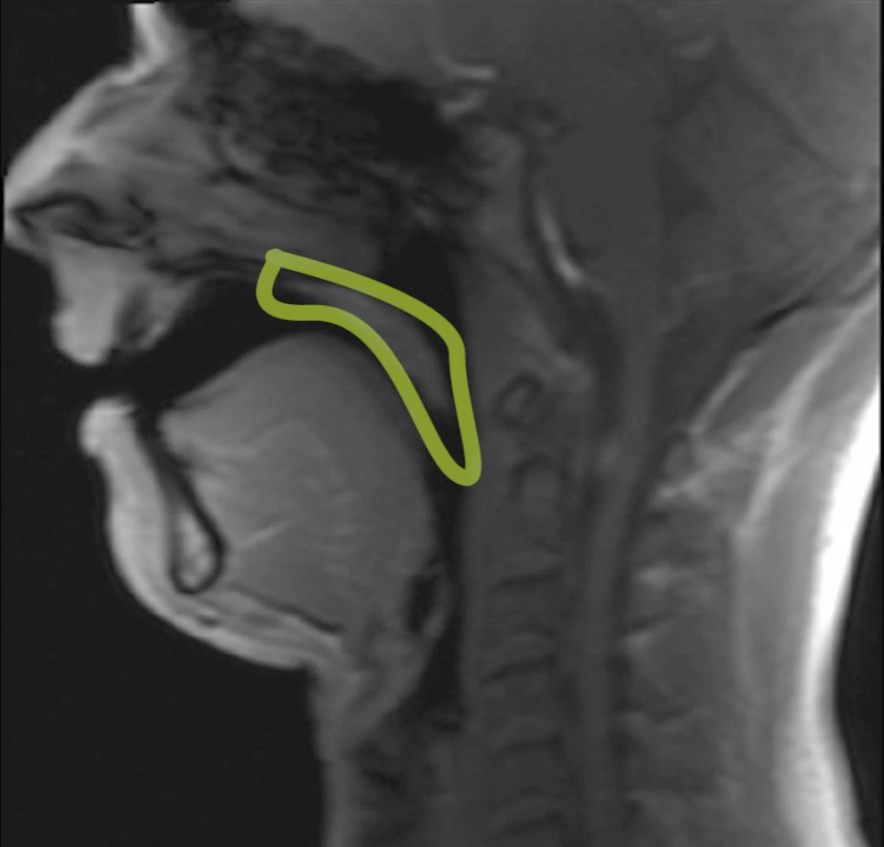

# Part 2 — Advanced Frenzel, Sequential Frenzel & Mouthfill

> **Purpose:** Build on Part 1 by developing advanced control of the oral air volume, larynx, tongue and cheeks, then apply that control to Advanced Frenzel, Sequential Frenzel and Mouthfill.

Part 1 established the basic equalization system:

**glottis → oral reservoir → tongue seal → working chamber → compression → equalization**

In Part 2 we begin to work with **smaller air volumes, more precise larynx control and more advanced ways of maintaining the working air volume**.

**larynx control → advanced tongue positions → H-lock → reverse packing → Sequential Frenzel → Mouthfill → integration → water application**

> **Advanced equalization is not about using more force. It is about controlling smaller air volumes with greater precision.**

---

## Adam Stern — MRI Equalization Experiments

Adam Stern used MRI video to observe what was actually moving during Frenzel, reverse packing and Mouthfill.

The experiments led him to place particular emphasis on **larynx movement and control**, and to propose alternative ways of teaching Frenzel and Mouthfill. Stern also explicitly describes the MRI observations as preliminary findings from experiments on his own anatomy, rather than definitive research applicable to every diver.

---

## 1. Larynx Control

The larynx must be controlled independently for both Frenzel and reverse packing.

### Exercise

Perform slow, controlled larynx movements:

1. Tongue neutral — 5 repetitions.
2. Tongue in **T** position — 5 repetitions.
3. Tongue in **P** position — 5 repetitions.
4. Tongue extended — 5 repetitions.
5. Tongue folded over itself — 5 repetitions.

Repeat the complete series **5 times**.

### Focus

- Can the larynx move independently?
- Can it move smoothly up and down?
- Can the tongue position remain stable while the larynx moves?
- Can the jaw and neck remain relaxed?

### OtoVent

Use the OtoVent to observe the pressure response produced by the larynx movement.

Compare:

**small movement → larger movement**

Focus on whether the pressure response changes predictably.

### UBA EQ Tool

Repeat the exercise with the UBA EQ Tool.

Compare:

- pressure peak;
- curve shape;
- repeatability;
- movement required.

> **The goal is independent larynx control, not maximum pressure.**

---

## 2. Advanced Tongue Positions

Advanced Frenzel can use different tongue positions to work with different available air volumes.

### Exercise

Practise:

**T → K → H**

For each position:

1. Create the lock.
2. Keep the glottis closed.
3. Raise the larynx.
4. Produce a small pressure pulse.
5. Reset.

### H-Lock Test

Extend the tongue outside the mouth and attempt a gentle Frenzel.

The exercise can help isolate the H-lock because the extended tongue makes the usual T and K positions unavailable.

### Focus

- Can you clearly distinguish T, K and H?
- Can you switch between them without unnecessary effort?
- Does the available air volume feel different?
- Does the pressure response change between positions?

### OtoVent

Compare:

**T → K → H**

Observe the physical pressure response and the movement required.

### UBA EQ Tool

Repeat the comparison and record:

- pressure peak;
- curve shape;
- repeatability.

> **The objective is not to find the strongest lock. The objective is to understand how each lock behaves with a different available air volume.**

---

## 3. H-Lock Control

The H-lock becomes particularly useful when the available oral volume becomes small.

### Exercise

1. Create the H-lock.
2. Keep the glottis closed.
3. Raise the larynx.
4. Produce a small pressure pulse.
5. Reset.
6. Repeat.

### OtoVent

Perform 5–10 controlled H-lock pulses.

Observe:

- movement;
- physical feedback;
- consistency.

### UBA EQ Tool

Perform the same 5–10 pulses.

Compare:

- pressure peak;
- curve shape;
- repeatability.

### Goal

Produce a consistent pressure response with:

**less air → less movement → less effort**

---

## 4. Reverse Packing

Reverse packing is used to replenish the oral reservoir from the lungs.

The basic mechanism is:

**seal → lower larynx → create vacuum → briefly open the vocal folds → air enters the mouth → close → Frenzel**

### Basic Exercise

1. Create a comfortable Frenzel lock.
2. Keep the glottis closed.
3. Lower the larynx.
4. Create a small vacuum.
5. Briefly open the vocal folds.
6. Allow a small amount of air to enter the mouth.
7. Close the vocal folds.
8. Return immediately to Frenzel.

### Focus

- Can the larynx drop independently?
- Can you create the vacuum without excessive movement?
- Can you bring in a small amount of air?
- Can you do it quietly?
- Can you immediately use the new air?

> **The target is a controlled reverse pack, not a large or noisy movement.**

---

## 5. Small Reverse Pack

The next step is precision.

Instead of refilling the entire mouth, practise bringing in only enough air for the next equalization.

### Exercise

1. Perform a passive exhale.
2. Use the H-lock.
3. Frenzel the remaining air from the oral and nasal cavity.
4. Stop when the available working volume is exhausted.
5. Perform a **very small reverse pack**.
6. Frenzel again.
7. Repeat.

### Focus

- How little air is actually required?
- Can the refill become smaller?
- Can it become quiet?
- Can you use the new air immediately?

> **The goal is to discover the minimum useful refill volume.**

---

## 6. Sequential Frenzel

Sequential Frenzel develops a different way of managing the available oral air.

Instead of using a single working chamber until it becomes empty, we maintain an **oral reservoir** and progressively transfer small amounts of air from that reservoir into the **working chamber**.

The sequence is:

**ORAL RESERVOIR → WORKING CHAMBER → COMPRESS → EQ**

Then repeat:

**ORAL RESERVOIR → WORKING CHAMBER → COMPRESS → EQ**

The key skill is the **controlled transfer of a small amount of air from the reservoir into the working chamber**, while keeping the working chamber isolated and ready for compression.

### Dry Practice

**Total practice: 40–60 seconds.**

1. Establish a small amount of air in the oral cavity.
2. Keep the glottis closed.
3. Maintain the air as an **oral reservoir**.
4. Create the tongue seal.
5. Isolate the **working chamber**.
6. Transfer a small amount of air from the oral reservoir into the working chamber.
7. Compress the working chamber.
8. Perform a gentle equalization.
9. Release and reset the working chamber.
10. Transfer another small amount from the oral reservoir.
11. Repeat the sequence.

### Sequence

**RESERVOIR → TRANSFER → WORKING CHAMBER → COMPRESS → EQ → RESET → TRANSFER → ...**

### Focus

- Can you maintain a separate oral reservoir?
- Can you transfer only a small amount of air?
- Can you isolate the working chamber after the transfer?
- Can you equalize without emptying the entire reservoir?
- Can you repeat the transfer smoothly?

> **The defining feature of Sequential Frenzel is the sequential transfer of air from the oral reservoir into the working chamber.**

### OtoVent + UBA EQ Tool

Use the OtoVent to feel the small pressure pulse produced by the working chamber.

Use the UBA EQ Tool to observe whether the pressure pulse remains small and controlled.

The objective is **precision and repeatability**, not maximum pressure.

### Frequency

Once the transfer mechanism is controlled, gradually increase the frequency of the sequence.

The goal is not to equalize as fast as possible.

The goal is to find the **smallest, easiest and most repeatable transfer** that provides enough air for the next equalization.

**Small transfer → small compression → EQ → reset → repeat**

As pressure increases, the sequence may need to become more frequent because the available working volume decreases.

> **Frequency follows air management. It is not a separate technique.**
---

## 7. Mouthfill — Introduction

Mouthfill is a different strategy from Sequential Frenzel.

Instead of repeatedly bringing small amounts of air from the lungs into the mouth, the diver establishes a larger reservoir of air in the mouth before continuing the descent.

The objective is to create and maintain that reservoir while using it for repeated equalization.

### Preparation

Mouthfill should only be introduced after reliable larynx, tongue and oral-volume control has been established.

> **Mouthfill is a separate technique, not simply a deeper version of Frenzel.**

---

## 8. Mouthfill Charge

### Dry Exercise

1. Take a comfortable breath.
2. Charge air into the oral cavity.
3. Lower the larynx.
4. Keep the larynx lowered.
5. Allow the cheeks to hold the charged air.
6. Relax the jaw and neck.

### Focus

- Can you maintain the mouthfill without leaking it?
- Can you keep the larynx lowered?
- Can the cheeks hold the reservoir without excessive tension?
- Can you maintain the reservoir without unnecessary pressure?

### OtoVent

Use the OtoVent to observe pressure changes while maintaining the mouthfill.

The objective is not to create maximum pressure.

The objective is to learn to **hold the reservoir without accidentally pressurising it**.

---

## 9. Mouthfill — Cheek Control

### Exercise

With the mouthfill established:

1. Keep the larynx lowered.
2. Compress the cheeks gently.
3. Release.
4. Repeat.

### Focus

- Can the cheeks create controlled pressure?
- Can the larynx remain lowered?
- Can you avoid unnecessary tongue or jaw movement?
- Can you maintain the reservoir while producing small pressure changes?

### OtoVent

Compare:

**small cheek compression → larger cheek compression**

Observe the physical response.

### UBA EQ Tool

Measure the pressure response.

Compare:

- pressure peak;
- curve shape;
- movement;
- repeatability.

> **The goal is to learn the cheeks as a controlled pressure source, not to push as hard as possible.**

---

## 10. Mouthfill — Air Translation

Now practise moving air between the cheeks and the area behind the tongue.

### Exercise

Practise:

**CHEEKS → BEHIND TONGUE → CHEEKS → BEHIND TONGUE**

Keep the movement small.

Then add:

**CHEEKS → BEHIND TONGUE → FRENZEL**

### Focus

- Can you move a small amount of air without losing the mouthfill?
- Can you keep the larynx controlled?
- Can you create a clear tongue seal?
- Can you perform a soft Frenzel from the transferred air?

### OtoVent

Observe the pressure response when air is moved behind the tongue and compressed.

### UBA EQ Tool

Compare the pressure response of:

**cheek compression**

versus

**tongue / Frenzel compression**

> **The goal is controlled air transfer, not maximum pressure.**

---

## 11. Single Source Mouthfill

Combine the previous exercises.

### Sequence

**CHARGE → LARYNX DOWN → CHEEKS → AIR TRANSLATION → FRENZEL → RETURN TO CHEEKS**

Repeat slowly.

### Focus

- Larynx remains lowered while the cheeks are used as the reservoir.
- Air moves between the cheeks and the Frenzel working area.
- The Frenzel pressure pulse remains small.
- The mouthfill is not lost between equalizations.
- Jaw and neck remain relaxed.

### OtoVent

Use the OtoVent to compare:

**cheek pressure → Frenzel pressure**

### UBA EQ Tool

Measure both pressure responses and compare:

- peak;
- curve;
- repeatability;
- effort.

---

## 12. Mouthfill Maintenance

The difficult part of Mouthfill is not only creating it.

It is maintaining the reservoir while continuing to equalize.

### Dry Exercise

Repeat:

**MOUTHFILL → FRENZEL → RESET → FRENZEL → RESET**

Keep the larynx controlled.

### Focus

- Do not allow the mouthfill to collapse.
- Do not swallow the reservoir.
- Avoid unnecessary tongue movement.
- Keep the pressure pulses small.
- Maintain relaxed cheeks and jaw.

### OtoVent

Use the OtoVent to observe whether each equalization remains controlled as the reservoir is maintained.

### UBA EQ Tool

Compare the first and later pressure pulses.

The pressure response should remain consistent rather than progressively becoming more forceful.

---

## 13. Advanced Frenzel vs Sequential Frenzel vs Mouthfill

All three techniques solve the same fundamental problem:

**How do we continue equalizing as the available air volume becomes smaller?**

The difference is **where the working air comes from and how it is managed**.

### Advanced Frenzel

The working air is replenished from the lungs using **reverse packing**.

**LUNGS → REVERSE PACK → WORKING VOLUME → FRENZEL**

A small amount of air is brought forward from the lungs when the available oral volume becomes insufficient.

The key skill is **small, controlled reverse packing**.

### Sequential Frenzel

A separate **oral reservoir** is maintained.

Small amounts of air are progressively transferred from this reservoir into the **working chamber**.

**ORAL RESERVOIR → WORKING CHAMBER → COMPRESS → EQ → REPEAT**

The key skill is **controlled sequential transfer** between the reservoir and the working chamber.

### Mouthfill

A larger oral reservoir is established before continuing the descent.

The diver then maintains and manages this reservoir, progressively using its air for equalization.

**CHARGE → MAINTAIN → MOVE AIR → FRENZEL → REPEAT**

The key skill is **maintaining and managing the mouthfill reservoir** throughout the descent.

### The Important Difference

The techniques should not be defined simply by how often the diver equalizes.

They are defined by **air management**:

| Technique | Air source / reservoir | Main control |
|---|---|---|
| **Advanced Frenzel** | Lungs → oral volume | Reverse packing |
| **Sequential Frenzel** | Oral reservoir → working chamber | Sequential transfer |
| **Mouthfill** | Large oral reservoir | Reservoir maintenance and management |

> **Advanced Frenzel replenishes the working volume from the lungs. Sequential Frenzel transfers air from an oral reservoir into the working chamber. Mouthfill establishes and manages a larger oral reservoir for continued equalization.**

### Training Goal

The objective is not to decide which technique is universally better.

The objective is to understand the different **air-management strategies**, develop precise control of each system, and learn when each strategy is appropriate.

> **Technique choice should follow control, anatomy, comfort and diving requirements — not maximum depth alone.**

---

## 14. Integrated Dry Practice

This session brings the three advanced air-management strategies together.

The objective is not to perform them as one continuous technique.

The objective is to be able to **identify, isolate and reproduce the different mechanisms**.

### Round 1 — Advanced Frenzel

Establish the working volume.

Perform:

**LUNGS → REVERSE PACK → WORKING VOLUME → FRENZEL**

Use a small reverse pack to replenish the available air.

Focus on:

- controlled larynx movement;
- minimal reverse-pack volume;
- stable tongue position;
- small and repeatable equalization.

### Round 2 — Sequential Frenzel

Establish an **oral reservoir**.

Perform:

**ORAL RESERVOIR → WORKING CHAMBER → COMPRESS → EQ → RESET**

Repeat the transfer several times without replenishing the reservoir from the lungs.

Focus on:

- maintaining a separate reservoir;
- transferring only a small amount of air;
- isolating the working chamber;
- resetting the chamber after each equalization.

### Round 3 — Mouthfill

Establish a larger oral reservoir.

Perform:

**CHARGE → MAINTAIN → MOVE AIR → FRENZEL → REPEAT**

Focus on:

- establishing the reservoir without excessive pressure;
- maintaining the mouthfill;
- moving only the amount of air required;
- keeping the system relaxed.

### Round 4 — Compare

Perform the three techniques separately.

After each round, observe:

| Question | Advanced Frenzel | Sequential Frenzel | Mouthfill |
|---|---|---|---|
| Where does the working air come from? | | | |
| Is there a separate reservoir? | | | |
| How is the working chamber replenished? | | | |
| What is the main movement? | | | |
| Where do you feel the air movement? | | | |
| How easy is it to repeat? | | | |

### OtoVent + UBA EQ Tool

Use the **OtoVent** to feel the physical effect of each mechanism.

Use the **UBA EQ Tool** to observe the pressure response.

The purpose is not to produce the highest pressure.

The purpose is to recognise whether the pressure pulse is:

**small → controlled → repeatable**

### Final Integration

The diver should be able to describe the difference before performing the movement:

**Advanced Frenzel**

> “I replenish the working volume from the lungs.”

**Sequential Frenzel**

> “I transfer air from the oral reservoir into the working chamber.”

**Mouthfill**

> “I maintain a larger oral reservoir and use it progressively.”

> **If the diver cannot explain where the air is coming from and where it is going, the mechanism is not yet under sufficient control.**

---

## 15. Common Problems

### “My reverse pack is too large.”

Reduce the larynx movement and practise a smaller refill.

### “I make a loud reverse-pack sound.”

Reduce the movement and aim for a quieter, smaller refill.

### “I lose the mouthfill.”

Reduce the amount of pressure and practise maintaining the reservoir without equalizing.

### “My mouthfill becomes hard to control.”

Return to cheek control and air translation.

### “I can create the mouthfill but cannot equalize from it.”

Practise:

**CHEEKS → BEHIND TONGUE → FRENZEL**

with very small pressure pulses.

### “I need more force as I go deeper.”

Stop increasing force.

Return to a shallower, comfortable depth and reassess the mechanism.

---

## 16. What This Practice Should Achieve

The diver should finish Part 2 with a broader and more precise equalization toolkit.

The progression is:

> **Larynx control → T/K/H → H-lock → reverse packing → small reverse pack → Sequential Frenzel → Mouthfill → air translation → integrated control → water application**

The central skill is:

> **Create, store, move and compress only the amount of air required for the next equalization.**

**Control comes before depth.**

**Precision comes before force.**

---

## References

### Adam Stern

- **Advanced Frenzel Equalisation for Deep Dives and Equalize Below Residual Volume**  
  https://www.adamfreediver.com/2019/03/14/advanced-frenzel-equalisation-for-deep-dives-equalize-below-residual-volume/

- **What I Learnt From My MRI Experiments**  
  https://www.adamfreediver.com/2018/12/18/a-new-approach-to-equalisation-what-i-learnt-from-my-mri-experiments/

- **How to Frenzel Equalise**  
  https://www.adamfreediver.com/2016/04/20/how-to-frenzel-equalise/

### Umberto Pelizzari / Apnea Academy

- **Corso di Apnea — Livello Avanzato**  
  https://www.umbertopelizzari.com/en/libri/italiano/corso-di-apnea-livello-avanzato/

> **Note:** The workshop structure is an original teaching progression. Adam Stern's publicly available material is used as a reference for Advanced Frenzel, reverse packing and Mouthfill concepts. Pelizzari's material is referenced for Sequential Frenzel and Mouthfill terminology; exercises are not reproduced from his book or course.
